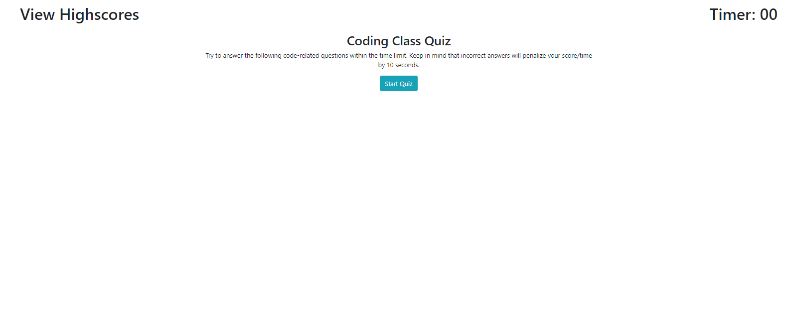

# [04_web_apis](https://millsy4.github.io/04_web_apis/)

This is a website that the user goes through the questions on a quiz, while getting timed, which will be there score.  If the users gets an answer correct or incorrect, it will flash whether they were right or not, and then if they were incorrect it will take away 10 seconds of their time.

After the user finishes the quiz, they will be prompted to enter their initials to record their score, which will then be placed in local storage.  If they click View Highscores after a highscore has been achieved, it will list all highscores that are stored on the local storage, which they can clear by hitting the clear button.

Tools I used to complete this include:

- [Javascript](https://www.javascript.com/)

- [Bootstrap](https://getbootstrap.com/)

The main objective of this homework was to learn how to use Javascript functions to create a dynamic webpage and to effectively use local storage.  It was a very tough homework because of my inexperience with Javascript, but it really helped with getting to understand the functions and scope within Javascript.

I can go through this project later on an edit it to more effectively store information and to be much more graphically pleasing.  Until then, I focused on getting the functionality down as well as I possibly could.

